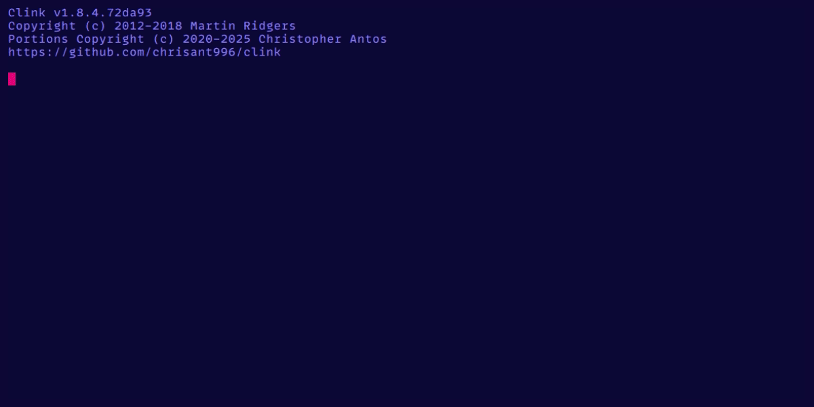
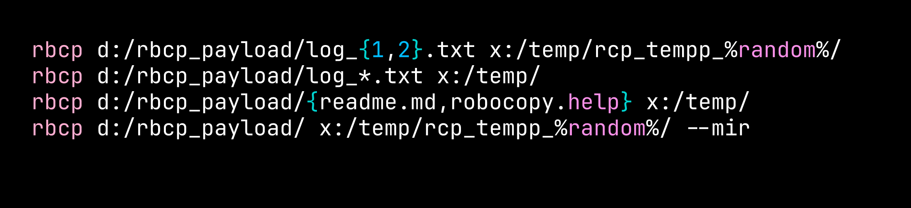

# rbcp - Robust Copy with Clean Output


[](https://github.com/plutonium-239/rbcp/releases)
[](./changelog.md)

<!--  -->

<center>

</center>

`rbcp` is a modern wrapper around `robocopy` that combines the efficiency and robustness of the time-tested Windows `robocopy` tool with a clean, user-friendly interface and simplified output.


_Some glyphs are not rendered properly in the GIF, they depend on you having a nerd font installed (for e.g. `-->`)_\
<sub>_BTW, this is `cmd.exe` running [`clink`](https://github.com/chrisant996/clink), turbocharging everything from the oh-my-posh prompt to the autocompletion and the syntax highlighting._</sub>

## Feature Highlights

- 🐚 Familiar unix `cp` input syntax
- 🚀 Modern real-time progress bar
- 📊 Clean, concise output format with important stats highlighted
- 🛡️ Preserves robocopy's legendary reliability
- 🎯 Smart defaults for general operation
- 🌟 Brace expansions, glob expansion and many more (powered by [`mvdan/sh`](https://github.com/mvdan/sh)) 
- 📈 Detailed statistics and performance metrics
- 🔄 Mirror mode support
- 🏃 Dry-run capability (i.e. list only, no copy)

## Installation

**Download a binary from the [latest release](https://github.com/plutonium-239/rbcp/releases/latest).**

*OR*

<details>
<summary>
Install using go:
</summary>

```cmd
go install github.com/plutonium-239/rbcp@latest
```

</details>

## Usage

Basic syntax:
```cmd
rbcp SOURCE DESTINATION [OPTIONS]
```

### Syntax - just use linux/`cp` syntax

<table>
  <tr>
  <td>

1. **copying file(s) in the current working directory:**
  
  </td>
  <td>
      
```cmd
rbcp C:\source\readme.md D:\destination
```

  </td>
  </tr>

  <tr>
  <td>

- You can also omit the path if it is the CWD:

  </td>
  <td>

```cmd
rbcp readme.md D:\destination
```

  </td>
  </tr>
  <tr>
  <td>

2. **Copy multiple files:**

  </td>
  <td>

```cmd
rbcp readme.md snippets.md d:/destination/
```

  </td>
  </tr>
  <tr>
  <td>

 - **Glob expansion**

  </td>
  <td>

```cmd
rbcp C:/source/log_*.txt d:/destination/
```

  </td>
  </tr>
  <tr>
  <td>

- **Brace expansion**

The bash `./a_{1,2}` brace expansion syntax is also supported:

  </td>
  <td>

```bash
rbcp C:/source/{readme.md,snippets.md} D:\destination
rbcp log_{1,2}.txt d:/destination/
```

  </td>
  </tr>
</table>


> [!CAUTION]
> `{`/`}` and `,` are valid characters in file paths in windows, so there might exist files with the exact path that you input, i.e. `C:/source/test{1,2}` itself is a file name (albeit **very rarely**, mostly only GUIDs and temp files). In these cases, `rbcp` will try and detect if such a file exists and ask for confirmation if you still want to continue. This is a limitation that can be solved by using a different syntax and can be discussed [here](https://github.com/plutonium-239/rbcp/discussions/1).

### Mirror directories:
```cmd
rbcp C:\source D:\destination -m
rbcp C:\source D:\destination --mir
```

### Dry run (list only):
```cmd
rbcp C:\source D:\destination -l
rbcp C:\source D:\destination --list
```

### Command Line Options

- `-m`, `--mir`: Mirror mode (equivalent to robocopy's `/MIR`)
- `-l`, `--list`: List-only mode (dry run)
- `--insane`: Disable sane defaults (currently sets \#retries to 2 and timeout between them to 1 sec)
- `-p`, `--preserve-exitcode`: Preserve robocopy's original exit code. By default, exit with code 0 on success and passthrough on copy failures.
- Additional robocopy arguments can be passed directly to `--passthrough`/`-[`.

## Features

### Modern I/O: (Input) Familiar linux `cp` syntax
  - Robocopy's syntax is inconvenient
  - Auto-suggest of any kind will not be able to suggest the right files
  - Makes more sense to learn a unified syntax applicable globally



### Modern I/O: (Output) Clean formatted output & completion summary
  - Highlighted stats for a quick overview
  - Hides skipped/mismatch/etc. when not present
  - **Summary includes:**
    - Files copied/skipped
    - Directories processed
    - Total data transferred
    - Transfer speed
    - Duration
    - Status of any failures or mismatches
    - Exit code of robocopy with a brief explanation

Refer to the demo GIF at the top.

### Smart Defaults

- Optimized retry settings (# of retries `/R:2` and timeout between them `/W:1` second)
- Automatic terminal width detection

### Real-time Progress

- Live progress bar showing:
  - Overall progress in files/bytes
  - Current file being copied
  - Remaining files/bytes


## Exit Codes

The tool maintains compatibility with robocopy's exit codes while providing a more user-friendly interpretation:

- 0: No errors
- 1: One or more files copied successfully
- 2: Extra files or directories detected
- 4: Mismatched files or directories found
- 8: Some files or directories could not be copied
- 16: Serious error - no files copied

Note: By default, non-error exit codes (< 8) are converted to 0 unless `--preserve-exitcode` is used.

## Environment Variables

- `LOGLEVEL`: Set logging verbosity level
- `COLUMNS`: Override terminal width detection

## Contributing

Contributions are welcome! Please feel free to submit a Pull Request.

## License

This project is open source and available under the [MIT License](LICENSE).

## Author

Created by [plutonium-239](https://github.com/plutonium-239)

## Acknowledgments

Built on top of the robust `robocopy` tool, with modern UI elements powered by:
- [Charm](https://github.com/charmbracelet) libraries for terminal UI
- [go-arg](https://github.com/alexflint/go-arg) for argument parsing